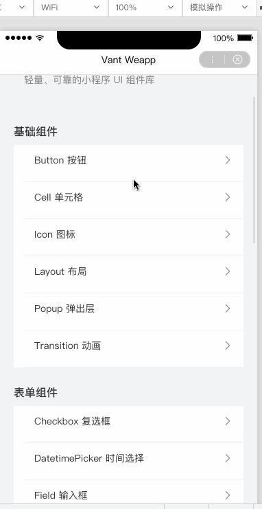

# 注意!!

## 有赞 百度小程序版本 基本改造完成,暂时picker还有点问题,抽空调一下,有些地方与文档有些差异,后面补一下...

## 百度小程序演示




# 注意!!


<p>
    <a href="https://github.com/youzan/">
    </a>
</p>
<p align="center">
    
</p>
<h3 align="center">轻量、可靠的小程序 UI 组件库</h3>

---

## 概述

[Vant Weapp](https://youzan.github.io/vant-weapp) 是有赞移动端组件库 [Vant](https://github.com/youzan/vant) 的小程序版本，两者基于相同的视觉规范，提供一致的 API 接口，助力开发者快速搭建小程序应用。

## 预览

扫描下方小程序二维码，体验组件库示例：


## 文档 还是 用有赞的

[https://youzan.github.io/vant-weapp](https://youzan.github.io/vant-weapp)

## 使用之前

使用 Vant Weapp 前，请确保你已经学习过微信官方的 [小程序简易教程](https://mp.weixin.qq.com/debug/wxadoc/dev/) 和 [自定义组件介绍](https://developers.weixin.qq.com/miniprogram/dev/framework/custom-component/)。

## 安装

### 方式一. 通过 npm 安装 (推荐)

小程序已经支持使用 npm 安装第三方包，详见 [npm 支持](https://developers.weixin.qq.com/miniprogram/dev/devtools/npm.html?search-key=npm)

```bash
# npm
npm i vant-weapp -S --production

# yarn
yarn add vant-weapp --production
```

### 方式二. 下载代码

直接通过 git 下载 Vant Weapp 源代码，并将`dist`目录拷贝到自己的项目中
```bash
git clone https://github.com/youzan/vant-weapp.git
```

## 使用组件

以按钮组件为例，只需要在 json 文件中引入按钮对应的自定义组件即可

```json
{
  "usingComponents": {
    "van-button": "/path/to/vant-weapp/dist/button/index"
  }
}
```

接着就可以在 wxml 中直接使用组件

```html
<van-button type="primary">按钮</van-button>
```

## 在开发者工具中预览

```bash
# 安装项目依赖
npm install

# 执行组件编译
npm run dev
```

打开`百度小程序开发者工具就行`
